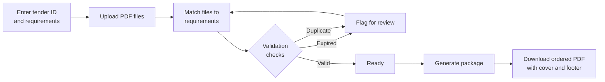
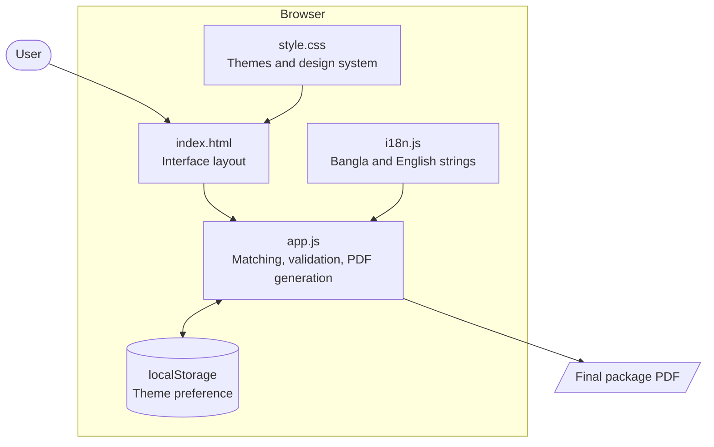
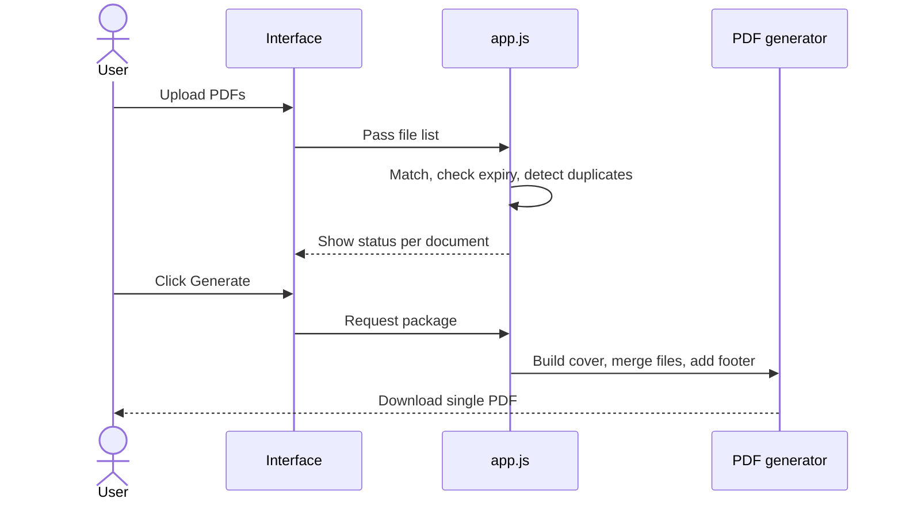
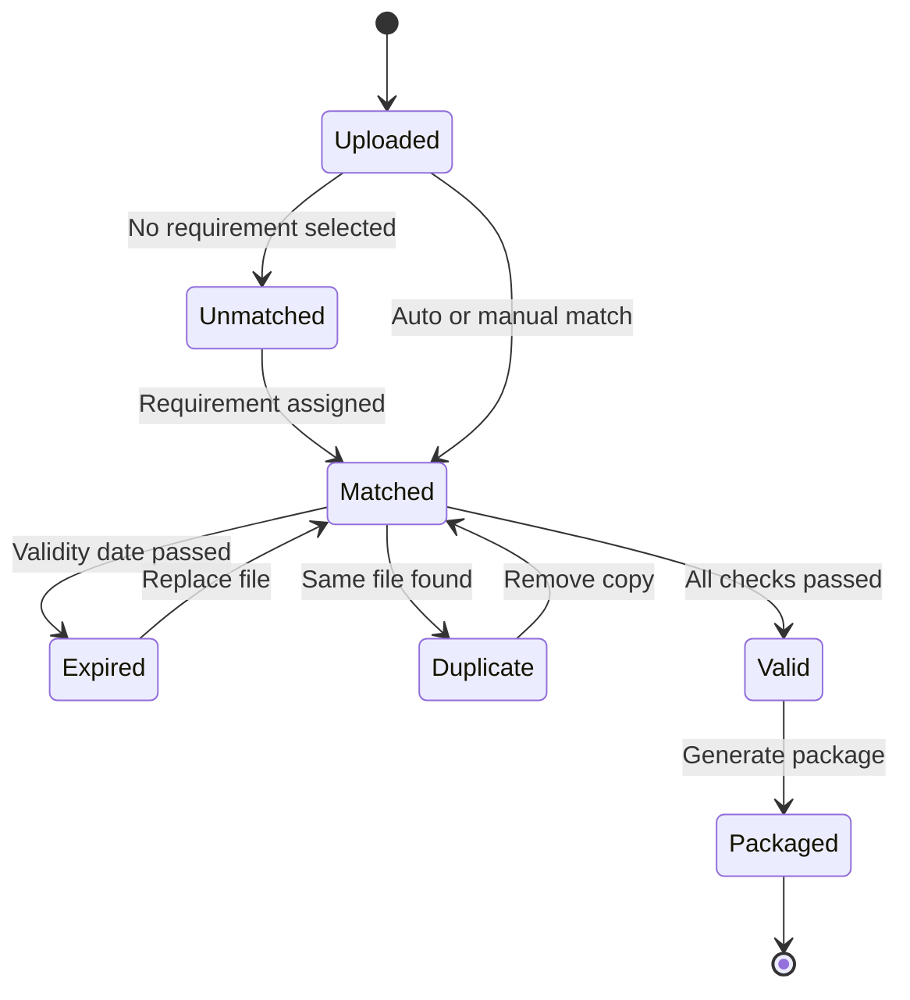

<div align="center">

# Tender Document Package Builder

**Match PDFs to tender requirements, validate them, and generate one ordered submission package.**

[](https://es-ratt.github.io/devfest-242-35-147-/)
[](LICENSE)
[](#project-context)


**Live application:** [https://es-ratt.github.io/devfest-242-35-147-/](https://es-ratt.github.io/devfest-242-35-147-/)

</div>

---

## Table of Contents

1. [Overview](#overview)
2. [Key Features](#key-features)
3. [How It Works](#how-it-works)
4. [Architecture](#architecture)
5. [Document Validation Lifecycle](#document-validation-lifecycle)
6. [Output Package Layout](#output-package-layout)
7. [Technology Stack](#technology-stack)
8. [Project Structure](#project-structure)
9. [Getting Started](#getting-started)
10. [Deployment](#deployment)
11. [Privacy and Security](#privacy-and-security)
12. [Project Context](#project-context)
13. [Author](#author)
14. [License](#license)

---

## Overview

Preparing a tender submission is usually a manual process: locating files, checking validity dates, removing duplicates, and merging everything in the right order. Mistakes at this stage can lead to disqualification.

The Tender Document Package Builder automates this workflow entirely in the browser. Users upload their PDFs, match each one to a tender requirement, review automatic expiry and duplicate checks, and export a single ordered PDF with a cover page and page-numbered footer.

The application is frontend-only. No server, account, or installation is required.

---

## Key Features

| Area | Capability |
| --- | --- |
| Requirement matching | Assign each uploaded PDF to a document required by the tender |
| Expiry validation | Flag documents that are expired or close to expiry |
| Duplicate detection | Identify repeated files before they enter the package |
| Package generation | Merge all matched documents into one PDF in the required order |
| Cover page | Auto-generated front page for the submission |
| Page footer | Tender ID on the left, current page number on the right |
| Localization | Full Bangla and English interface |
| Theming | Light and dark themes, preference saved in `localStorage` |
| Privacy | All processing happens locally in the browser |

---

## How It Works



---

## Architecture

The application is a static, single-page client. All logic runs in the browser and there is no network dependency for core features.



### Request flow



---

## Document Validation Lifecycle

Each uploaded document moves through the following states.



---

## Output Package Layout

| Section | Content |
| --- | --- |
| Page 1 | Cover page with tender details |
| Pages 2 to N | Matched documents in the tender-defined order |
| Footer (every page) | Tender ID (left) and current page number (right) |

---

## Technology Stack

| Layer | Technology |
| --- | --- |
| Markup | HTML5 |
| Styling | CSS3 with a custom light and dark design system |
| Logic | Vanilla JavaScript (ES6+) |
| Localization | Custom `i18n.js` module |
| Persistence | Browser `localStorage` |
| Hosting | GitHub Pages |

The project has no framework, no build step, and no npm dependencies.

---

## Project Structure

```
devfest-242-35-147-/
├── index.html    # Application layout
├── style.css     # Themes and UI styling
├── app.js        # Matching, validation, and PDF generation
├── i18n.js       # Bangla and English translations
├── LICENSE       # MIT license
└── README.md     # Project documentation
```

---

## Getting Started

### Use online

Open the live application: [https://es-ratt.github.io/devfest-242-35-147-/](https://es-ratt.github.io/devfest-242-35-147-/)

### Run locally

```bash
git clone https://github.com/es-ratt/devfest-242-35-147-.git
cd devfest-242-35-147-
```

Open `index.html` directly in a browser, or serve it locally:

```bash
python -m http.server 5500
```

Then visit `http://localhost:5500`.

### Usage steps

| Step | Action |
| --- | --- |
| 1 | Enter the tender ID and list the required documents |
| 2 | Upload PDF files |
| 3 | Match each file to its requirement |
| 4 | Resolve any expiry or duplicate warnings |
| 5 | Generate and download the final package |

---

## Deployment

The site is deployed with GitHub Pages directly from the `main` branch.

| Setting | Value |
| --- | --- |
| Source | Deploy from a branch |
| Branch | `main` |
| Folder | `/ (root)` |
| URL | `https://es-ratt.github.io/devfest-242-35-147-/` |

Every push to `main` updates the live site automatically.

---

## Privacy and Security

| Concern | Approach |
| --- | --- |
| File handling | Files are processed locally and never uploaded to a server |
| Accounts | None required |
| Stored data | Only the theme preference is saved in `localStorage` |
| External services | None required for core functionality |

---

## Project Context

Built for **AI DevFest 2026**, a solo vibe-coding contest organized by CPC at Daffodil International University.

---

## Author

**Esrat Jhahan Nur**
Software Engineering, Daffodil International University

[](https://github.com/es-ratt)
[](https://es-ratt.github.io)
[](https://linkedin.com/in/esratjhahann/)

---

## License

Released under the [MIT License](LICENSE).